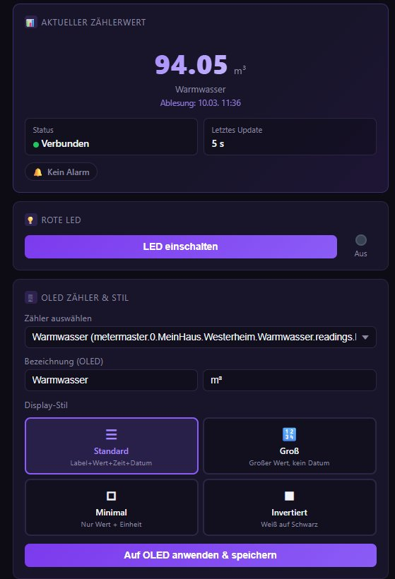
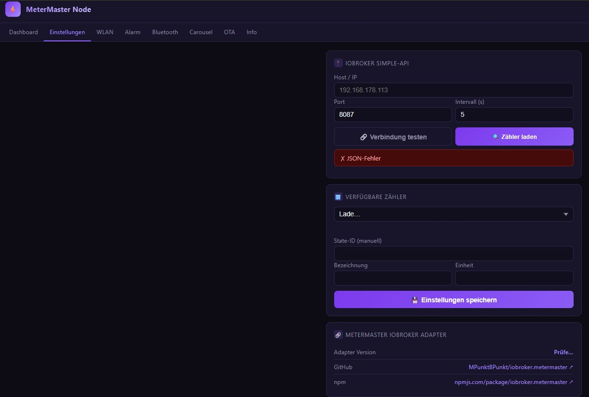
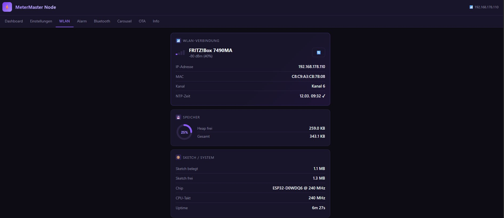
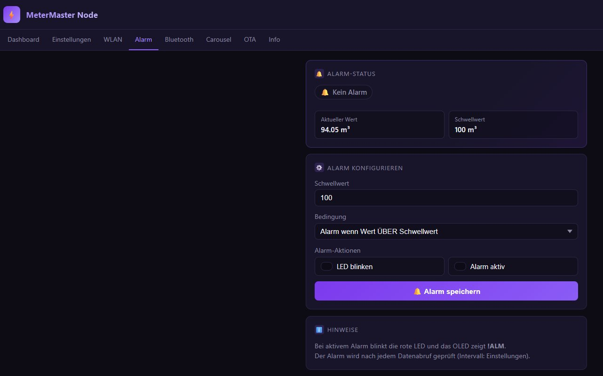
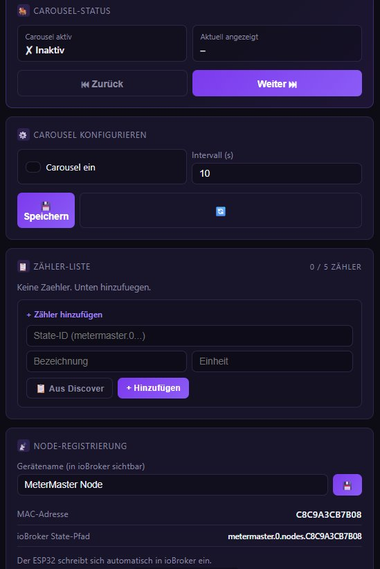
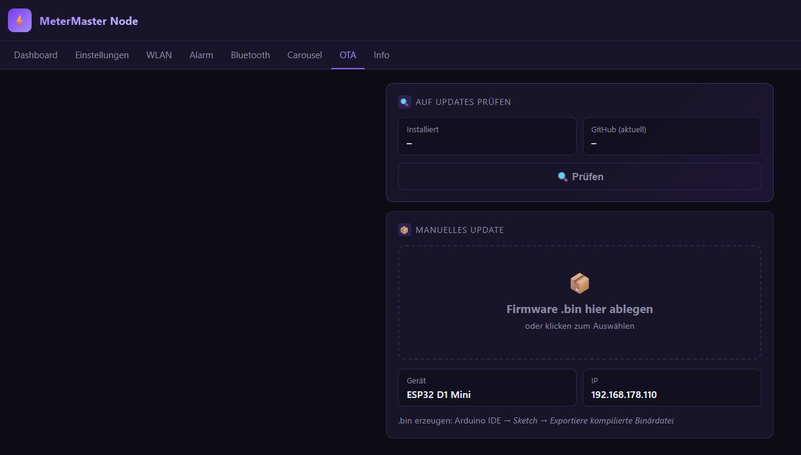
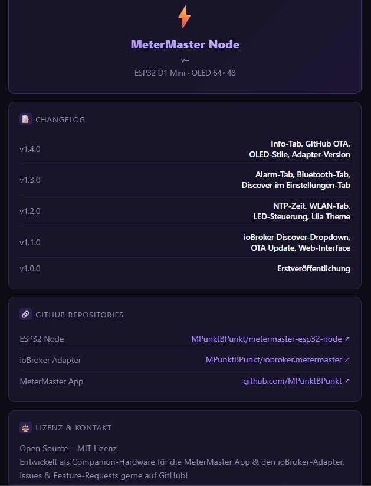

# ⚡ MeterMaster ESP32 Node

**v0.4.1** · ESP32 D1 Mini + 64×48 OLED

Ein WLAN-Display-Node für das [MeterMaster](https://github.com/MPunktBPunkt)-Ökosystem. Der ESP32 holt Zählerwerte aus ioBroker und zeigt sie auf einem winzigen OLED-Display an – konfigurierbar über eine eingebaute Web-Oberfläche.

---

## Screenshots

### Dashboard – Aktueller Zählerwert & Adapter-Heartbeat


### Einstellungen – ioBroker Verbindung & Zählerauswahl


### WLAN & Systeminfo


### Alarm


### Carousel – Mehrere Zähler automatisch blättern


### OTA – Firmware-Update über Browser


### Info & Changelog


---

## Hardware

| Komponente | Modell |
|---|---|
| Mikrocontroller | ESP32 D1 Mini (WEMOS) |
| Display | 0.66" OLED 64×48, SSD1306, I²C |
| SDA | GPIO 21 |
| SCL | GPIO 22 |
| Rote LED | GPIO 2 (active HIGH) |

---

## Features

- **Echtzeit-Zählerwerte** via ioBroker Simple-API (HTTP, Port 8087)
- **4 OLED-Stile:** Standard, Groß, Minimal, Invertiert
- **Carousel-Modus:** bis zu 5 Zähler automatisch blättern
- **Alarm:** LED-Blinken + OLED-Warnung bei Schwellwertüberschreitung
- **Node-Registrierung:** ESP32 meldet sich automatisch beim MeterMaster-Adapter an (Port 8089)
- **Fernsteuerung:** Zähler wechseln und LED steuern direkt aus dem Adapter-UI
- **Heartbeat-Anzeige:** Dashboard zeigt Verbindungsstatus zum Adapter in Echtzeit
- **OTA-Update:** Firmware direkt über den Browser einspielen (lokal oder von GitHub)
- **Debug-Tab:** Live-Log, Heap-Anzeige, Neustart-Button
- **WiFiManager:** WLAN-Konfiguration ohne Neukompilieren

---

## Libraries (Arduino Library Manager)

| Library | Autor | Version |
|---|---|---|
| WiFiManager | tzapu | ≥ 2.0.17 |
| **U8g2** | olikraus | ≥ 2.34 |
| ArduinoJson | Benoit Blanchon | ≥ 6.21 |

> **Hinweis:** Ab v0.3.0 wird **U8g2** statt Adafruit SSD1306 verwendet – Adafruit-Libraries können deinstalliert werden.

**Board:** WEMOS D1 MINI ESP32 · ESP32 Board-Package 1.0.6  
**Partition Scheme:** Default (kein BLE nötig)

---

## Installation

1. **Arduino IDE** öffnen, Board `WEMOS D1 MINI ESP32` wählen
2. Libraries über den Library Manager installieren (siehe oben)
3. `MeterMaster_ESP32_Node.ino` öffnen und hochladen
4. Beim ersten Start öffnet der ESP32 einen WLAN-Hotspot **`MeterMaster-Setup`**
5. Mit dem Hotspot verbinden → Konfigurationsseite öffnet sich automatisch
6. WLAN-Zugangsdaten eingeben → ESP32 verbindet sich und ist unter seiner IP erreichbar

---

## Konfiguration

Nach dem Start ist die Web-Oberfläche unter der IP des ESP32 erreichbar (z.B. `http://192.168.178.110`).

### Einstellungen-Tab

**ioBroker Simple-API** (Zählerwerte lesen)
- Host/IP des ioBroker-Servers, z.B. `192.168.178.113`
- Port Simple-API: `8087` (Standard)
- Fetch-Intervall in Sekunden

**MeterMaster Adapter** (Registrierung & Fernsteuerung)
- Port Adapter: `8089` (Standard)
- Verbindungstest prüft ob der Adapter erreichbar ist

Zähler über „Zähler laden" aus ioBroker auswählen oder State-ID manuell eingeben.

---

## Zusammenspiel mit dem ioBroker-Adapter

Der Node benötigt den [iobroker.metermaster](https://github.com/MPunktBPunkt/iobroker.metermaster)-Adapter für die vollständige Funktionalität.

### Registrierung (automatisch)
- **Beim Start** und danach **alle 60 Sekunden** sendet der ESP32 einen Heartbeat:
  ```
  POST http://{iobHost}:8089/api/register
  { "mac": "C8C9A3CB7B08", "ip": "192.168.178.110", "name": "MeterMaster Node", "version": "0.4.1" }
  ```
- Der Adapter legt alle nötigen ioBroker-States unter `metermaster.0.nodes.{MAC}.*` automatisch an
- Falls der Adapter neu gestartet wird, registriert sich der ESP32 innerhalb der nächsten 60 Sekunden automatisch neu

### Config & Fernsteuerung
Alle 15 Sekunden fragt der ESP32 seine Konfiguration ab:
```
GET http://{iobHost}:8089/api/nodes/{MAC}/config
```

Der Adapter kann damit:
- **Zähler wechseln** – neuer Zähler erscheint sofort auf dem OLED
- **Carousel konfigurieren** – bis zu 5 Zähler mit Wechselintervall

### Sofortbefehle (cmd)
Über den Nodes-Tab des Adapters können Sofortbefehle gesendet werden:
- **LED ein/aus** – zur visuellen Verbindungsbestätigung
- **Zähler wechseln** – wird beim nächsten Poll (≤ 15s) übernommen

---

## OTA-Update

**Manuell (Drag & Drop):** Im OTA-Tab die `.bin`-Datei hochladen.

`.bin` erzeugen: Arduino IDE → *Sketch → Exportiere kompilierte Binärdatei*

**Von GitHub:** Im OTA-Tab auf „Releases laden" klicken – der Node vergleicht seine Version mit dem neuesten GitHub-Release und kann die Firmware direkt einspielen.

---

## API-Endpunkte

Alle Endpunkte unter `http://{ESP32-IP}/`

| Endpunkt | Methode | Beschreibung |
|---|---|---|
| `/api/version` | GET | Firmware-Version, Build-Datum, GitHub-Release-Info |
| `/api/status` | GET | Zählerwert, LED, Alarm, **Heartbeat-Status** |
| `/api/settings` | GET/POST | Alle Einstellungen inkl. adapterPort |
| `/api/test` | POST | Verbindungstest zur Simple-API |
| `/api/testadapter` | POST | Verbindungstest zum MeterMaster Adapter |
| `/api/sysinfo` | GET | WLAN, Heap, CPU, Uptime, NTP |
| `/api/discover` | GET | Verfügbare Zähler aus ioBroker laden |
| `/api/alarm` | POST | Alarm konfigurieren |
| `/api/carousel` | GET/POST | Carousel-Konfiguration |
| `/api/carousel/next` | GET | Manuell zum nächsten Zähler blättern |
| `/api/nodeinfo` | GET | Vollständige Node-Info als JSON |
| `/api/nodename` | GET | Node-Namen setzen (`?name=...`) |
| `/api/oled` | POST | OLED-Zähler und Stil setzen |
| `/api/led` | GET | LED steuern (`?state=on\|off\|toggle`) |
| `/api/log` | GET | Debug-Log (letzte 30 Einträge) |
| `/api/restart` | GET | ESP32 neu starten |
| `/api/ota-github` | POST | OTA von GitHub Release |
| `/update` | POST | OTA Firmware-Upload (lokal) |

---

## ioBroker States (angelegt vom Adapter)

```
metermaster.0.nodes.{MAC}/
├── ip         ← IP-Adresse des ESP32
├── name       ← Gerätename
├── version    ← Firmware-Version
├── lastSeen   ← Timestamp letzter Heartbeat (ms)
├── config     ← Konfiguration (JSON, Adapter schreibt)
├── configAck  ← Quittierung der Config durch ESP32
└── cmd        ← Sofortbefehle (JSON, Adapter schreibt, ESP32 löscht nach Ausführung)
```

---

## Changelog

| Version | Änderungen |
|---|---|
| **v0.4.1** | cmd-Verarbeitung: LED und Zähler per Adapter fernsteuern; Heartbeat-Kachel im Dashboard; Adapter-Verbindungstest im Einstellungen-Tab; **Bugfix:** OLED-Stil wird jetzt persistent gespeichert (überlebt Neustart) |
| **v0.4.0** | Registrierung direkt beim MeterMaster-Adapter (Port 8089) statt simple-api; adapterPort-Einstellung; registerOk-Status |
| **v0.3.0** | U8g2 OLED-Library (statt Adafruit); Carousel; OTA GitHub-Dropdown mit semver-Vergleich; Node-Registrierung; Debug-Tab; `/api/log`; `/api/restart` |
| **v0.1.4** | Info-Tab, GitHub OTA-Check, 4 OLED-Stile, Adapter-Version |
| **v0.1.3** | Alarm-Tab, Bluetooth-Tab (Platzhalter) |
| **v0.1.2** | NTP-Zeit, WLAN-Tab, LED-Steuerung, Lila Theme |
| **v0.1.1** | ioBroker Discover-Dropdown, OTA-Update, Web-Interface |
| **v0.1.0** | Erstveröffentlichung |

---

## Lizenz

MIT – siehe [LICENSE](LICENSE)

Entwickelt als Companion-Hardware für die [MeterMaster App](https://github.com/MPunktBPunkt/MeterMaster) & den [ioBroker-Adapter](https://github.com/MPunktBPunkt/iobroker.metermaster).  
Issues & Feature-Requests gerne auf [GitHub](https://github.com/MPunktBPunkt/esp32.MeterMaster)!
